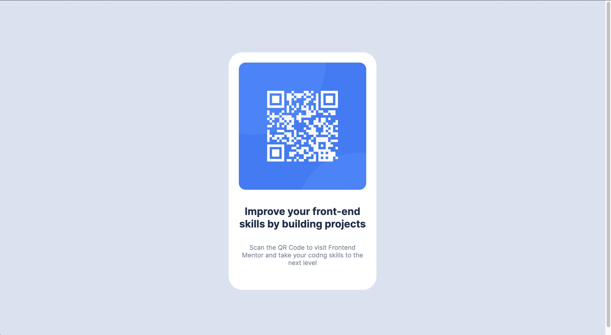

# Frontend Mentor - QR code component solution

This is a solution to the [QR code component challenge on Frontend Mentor](https://www.frontendmentor.io/challenges/qr-code-component-iux_sIO_H). Frontend Mentor challenges help you improve your coding skills by building realistic projects.

## Table of contents

- [Screenshot](#screenshot)
- [Links](#links)
- [Built with](#built-with)
- [Author](#author)

**Note: Delete this note and update the table of contents based on what sections you keep.**

## Screenshot

### Desktop View

### Mobile View

## Links

- Solution URL:-  https://www.frontendmentor.io/solutions/responsive-html-css-qr-component-EWT5nnI6ls
- Live Site URL:-  https://frontend-master-challenge1.vercel.app/

## Built with

## Author

[ ~ Saarthak Tuli](https://github.com/SaarthakTuli)
